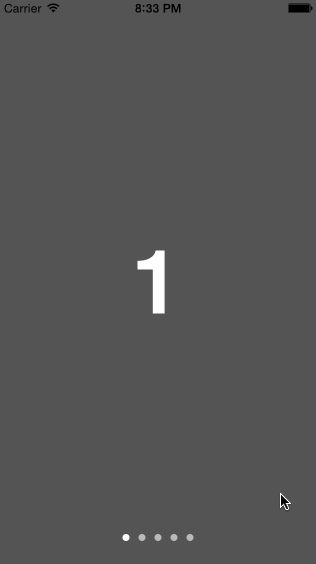

# KVNMaskedPageControl

A drop-in replacement for UIPageControl that allows seamless transition between different dot styles, one for each page, using a masking effect.

<p align="center">
  
</p>

UIPageControls are most often used in conjunction with a UIScrollView. In iOS 6, the ability to change the colors of the dots within the UIPageControl was added. This is great when the pages in a UIScrollView have a consistent theme. However, if your scroll view has distinct color pallets for each page there is no elegant way to switch between two colors. Adding a background might needlessly clutter the UI or switching colors after scrolling would lead to control looking odd during the gesture.

KVNMaskedPageControl allows you to define a color for each page through a data source similar to the one used in UITableView. By passing scroll events to the control, it seamlessly masks between the distinct style on the page's boundaries

[](http://cocoadocs.org/docsets/KVNMaskedPageControl)
[](http://cocoadocs.org/docsets/KVNMaskedPageControl)

## Installation

KVNMaskedPageControl is available through [CocoaPods](http://cocoapods.org), to install
it simply add the following line to your Podfile:

    pod "KVNMaskedPageControl"

### Manual Installation

To install manually, copy the following files into your project:
- KVNMaskedPageControl.h
- KVNMaskedPageControl.m

## Usage

KVNMaskedPageControl is a drop-in replacement for UIPageControl and can be used with only one change: __Do not set the indicator and current page colors using the UIPageControl methods__. Instead, implement the data source methods and provide them as needed. KVNMaskedPageControl can also be created from a XIB/Storyboard.

```objective-c
KVNMaskedPageControl *pageControl = [[KVNMaskedPageControl alloc] init];
[pageControl setNumberOfPages:pageNumber];
[pageControl setCenter:somePoint];
[pageControl setDataSource:self];
```

Implement the data source methods to supply the page colors when needed. In order to account for over-scrolling or bouncing, __the range of possible indices are -1 to N+1__. Returning nil in either of the methods will result in the default UIPageControl color being set, or color defined by the UIApperanceProxy.

```objective-c
- (UIColor *)pageControl:(KVNMaskedPageControl *)control pageIndicatorTintColorForIndex:(NSInteger)index {
    if (index % 2 == 0) {
        return nil;
    } else {
        return [UIColor colorWithWhite:0 alpha:.5];
    }
}

- (UIColor *)pageControl:(KVNMaskedPageControl *)control currentPageIndicatorTintColorForIndex:(NSInteger)index {
    if (index % 2 == 0) {
        return nil;
    } else {
        return [UIColor colorWithWhite:0 alpha:.8];

    }
}
```

To update the masking, supply the control with the current UIScrollView offset and frame. Both the offset and frame must use the page control's parent view as the reference frame. If the page control and scroll view share a parent view then passing the values unchanged is sufficient. If that isn't the case, these values will need to be calculated from the parent view reference frame.

```objective-c
- (void)scrollViewDidScroll:(UIScrollView *)scrollView {
    [self.pageControl maskEventWithOffset:scrollView.contentOffset.x frame:scrollView.frame];
}
```

### Extending Functionality

This component was designed for use with a UIScrollView, which is why the ```maskEventWithOffset:``` and the math to create the masking effect is so tightly coupled with UIScrollView geometry and scroll events. For other uses, you can create a subclass, define your own method that calls the data source to set the correct colors and pass the percentage of the color of the next page to be revealed (the origin is to the right) to ```updateMaskWithPercentage```.

Alternatively, you can hack around the behavior of ```maskEventWithOffset:```. Passing the bounds of the page control as the frame will allow you to send the width of however much you want revealed for the current page as the offset. Adding multiples of the bounds to the offset will allow you to increment the page number. 

```objective-c
// 1st page, no mask
[self.pageControl maskEventWithOffset:0 frame:self.pageControl.bounds];
// 1st page, 50/50 mask with 2nd page
[self.pageControl maskEventWithOffset:CGRectGetWidth(self.pageControl.bounds) / 2 frame:self.pageControl.bounds];
// 2nd page, no mask
[self.pageControl maskEventWithOffset:CGRectGetWidth(self.pageControl.bounds) frame:self.pageControl.bounds];
// 2nd page, 50/50 mask with 3rd page
[self.pageControl maskEventWithOffset:CGRectGetWidth(self.pageControl.bounds) + CGRectGetWidth(self.pageControl.bounds) / 2 frame:self.pageControl.bounds];
```


## Requirements

iOS 6+
ARC

## Author

Kevin, kevin@kvnd.me

## License

KVNMaskedPageControl is available under the MIT license. See the LICENSE file for more info.

